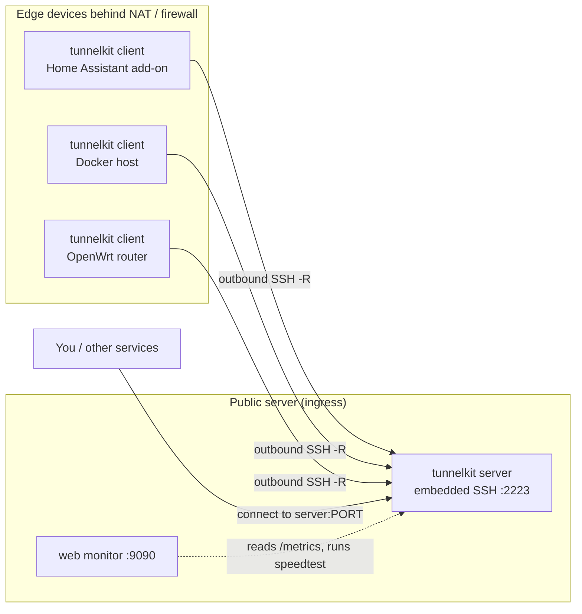
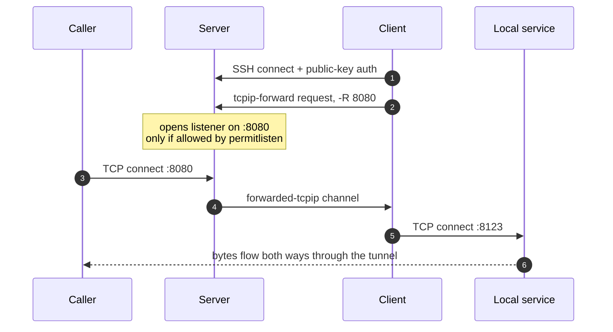
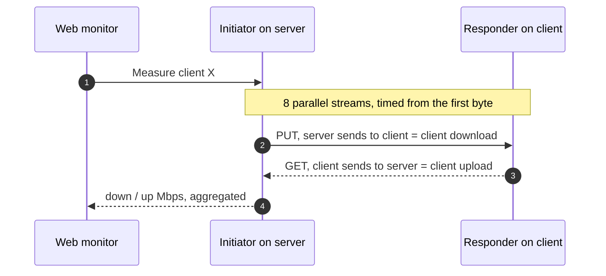

# tunnelkit

A client/server for a **reverse SSH tunnel** to a public server, with a **stats
endpoint** (so a monitor can see traffic, uptime and reconnections) and a
**client↔server speedtest**. A single Go binary (standard library only, no
dependencies), packaged three ways: a **Home Assistant add-on**, a **Docker
image** and an **OpenWrt package**. Everything lives in one monorepo.

> It replaces an `autossh` + hourly-cron workaround: it reconnects on the real
> ssh exit signal (not a monitor port the server rejects), with
> `ExitOnForwardFailure`, sane keepalives, `boot: auto` and a built-in watchdog.

## Layout

```
tunnelkit/
├── core/          Go code: cmd/client and cmd/server + shared internal/
├── autossh-plus/  Home Assistant add-on (uses the CI image via image:)
├── docker/        plain image + compose (client)
├── openwrt/       Makefile (.ipk) + procd init + uci
├── server/        server side: tunnel server + speedtest + web monitor
└── .github/       CI: multi-arch images → GHCR + OpenWrt binaries
```

A **single image/binary** from CI feeds all three packagings.

## The binary

```
tunnelkit client      # reverse SSH tunnel + /metrics + speedtest responder
tunnelkit speedtest   # initiator: measures a client THROUGH THE TUNNEL (run on the server)
tunnelkit responder   # standalone speedtest responder (host with no tunnel)
```

**The speedtest is always client↔server through the tunnel**: the client starts
the responder and forwards it with `-R speedtest_forward_port`; the server
(initiator) measures against `tunnelkit-server:<that port>`, so what is measured
is the real tunnel throughput, and it is triggered from the server.

Configuration comes from **flags**, **`TK_*` environment variables** or
**`/data/options.json`** (Home Assistant add-on), in that order of priority.

## How it works

### Topology

Edge devices sit behind NAT or a firewall, so they **dial out** to the public
server and ask it to open ports on their behalf (SSH reverse forwarding). Anyone
who can reach the server then reaches the edge service through the tunnel — no
inbound port on the edge, no public IP needed.



### One reverse tunnel, step by step

Each `-R` forward turns a port on the **server** into a doorway to a service on
the **client**. The server only opens a port a key is allowed to (`permitlisten`),
and traffic is counted as it is piped.



The client also forwards two extra ports the server uses for observability: its
`/metrics` endpoint (`stats_forward_port`) and the speedtest responder
(`speedtest_forward_port`).

### Speedtest through the tunnel

The panel triggers the **initiator** on the server, which measures against the
**responder** on the client. A single stream over a high-latency link is capped
by the SSH channel window divided by the round-trip time (the bandwidth–delay
product), not by the link itself — so the initiator opens **8 parallel streams**
to fill the link, like a real speedtest.



## Usage

All examples use placeholder values: a server reachable at `example.com`, an SSH
login `tunnel`, and a tunnel SSH port `2223`.

### Client (Docker)

Run the client and forward a local service (e.g. Home Assistant on `:8123`) to
port `8080` on the server:

```bash
docker run -d --name tunnelkit-client \
  --restart unless-stopped \
  --network host \
  -v ~/.ssh/id_ed25519:/keys/id_ed25519:ro \
  -e TK_HOST=example.com \
  -e TK_SSH_PORT=2223 \
  -e TK_USER=tunnel \
  -e TK_KEY_FILE=/keys/id_ed25519 \
  -e TK_FORWARDS="8080:localhost:8123" \
  -e TK_STATS_FORWARD_PORT=8048 \
  -e TK_SPEEDTEST_FORWARD_PORT=8047 \
  ghcr.io/adriansanchis87/tunnelkit-client:latest
```

`TK_FORWARDS` is comma-separated for multiple `-R` forwards, e.g.
`"8080:localhost:8123,8081:localhost:80"`. `TK_STATS_FORWARD_PORT` exposes the
client's `/metrics` to the server (0 = off) and `TK_SPEEDTEST_FORWARD_PORT`
exposes the speedtest responder (0 = off).

### Client (binary / flags)

The same thing with the raw binary:

```bash
tunnelkit client \
  --host example.com --ssh-port 2223 --user tunnel \
  --key ~/.ssh/id_ed25519 \
  --forwards 8080:localhost:8123 \
  --stats-forward 8048 --speedtest-forward 8047
```

### Server

Bring up the tunnel server (embedded Go SSH server, no external ssh daemon).
From `server/` (or `docker/`):

```bash
docker compose -f server/docker-compose.yml up -d
```

Key settings (see `server/docker-compose.yml`):

- `TK_SERVER_SSH_ADDR=:2223` — where the embedded SSH server listens.
- `TK_SERVER_MONITOR_ADDR=:9090` — web monitor panel (empty = off).
- `TK_SERVER_HOST_KEY=/data/host_key` — host key, created on first run.
- `TK_SERVER_AUTHORIZED_KEYS=/data/authorized_keys` — allowed public keys.
- `TK_SERVER_TRAFFIC_FILE=/data/traffic.json` — per-port/per-day traffic
  persistence.

The `/data` volume holds `host_key`, `authorized_keys` and `traffic.json`.

**authorized_keys format**: one public key per client, each restricted to the
ports it may forward with `permitlisten="PORT"` (repeat the option for several
ports):

```
permitlisten="8080",permitlisten="8048",permitlisten="8047" ssh-ed25519 AAAA... client-a
permitlisten="9090" ssh-ed25519 AAAA... client-b
```

The speedtest initiator lives in the same image and measures a client through
its forwarded port:

```bash
docker exec tunnelkit-server tunnelkit-server speedtest --speedtest-addr localhost:8047
```

### Monitor panel

When `TK_SERVER_MONITOR_ADDR` is set, the server serves a web UI at that address
(e.g. `http://example.com:9090`). It shows per-client status (connected,
uptime, reconnections, last error), traffic with a per-port and per-day
breakdown, and a speedtest button. The speedtest runs client↔server through the
tunnel using 8 parallel streams, so it reports the real tunnel throughput.

### OpenWrt

Install the package and configure it via UCI:

```bash
opkg install tunnelkit_0.1.0-1_<arch>.ipk
# edit /etc/config/tunnelkit
/etc/init.d/tunnelkit enable
/etc/init.d/tunnelkit start
```

`/etc/config/tunnelkit` mirrors the client options (`host`, `ssh_port`,
`username`, `key_file`, `remote_forwarding`, `stats_forward_port`,
`speedtest_forward_port`). The `ssh_impl` option selects the SSH backend:

- `option ssh_impl 'dropbear'` — uses the SSH client already in the OpenWrt
  base. Dropbear has a small SSH channel window that limits throughput on
  high-latency links.
- `option ssh_impl 'openssh'` — much better throughput on high-latency links,
  but needs the `openssh-client` package and an OpenSSH-format private key.

**Tiny-flash routers** that cannot store the ~6 MB binary in flash can run it
from `/tmp` (RAM) and re-download it on every boot. Keep the key in flash
(`/etc/tunnelkit/id_*`, it persists) and set:

```
option binary '/tmp/tunnelkit-client'
option binary_url 'https://github.com/OWNER/tunnelkit/releases/download/vX.Y.Z/tunnelkit-client-<arch>'
```

The service fetches the binary with `uclient-fetch` on start if it is missing.
Prebuilt static binaries per architecture are attached to each GitHub release.

### Home Assistant add-on

In Home Assistant go to Settings → Add-ons → Store → ⋮ → Repositories and paste
this repo's URL. The **Autossh Plus** add-on appears; install it and set the
options (host, username, key file, remote forwarding, etc.) from the add-on
configuration tab. It runs with `boot: auto` and a watchdog, so the Supervisor
restarts it if it dies. See `autossh-plus/DOCS.md` for the full option list.

## Server side

The server is the speedtest **initiator** and measures on demand against each
client's forwarded port. The web monitor reads the clients' `/metrics` and can
run these speedtests on demand.

## Status

Builds and cross-compiles (amd64, arm64, armv7, mips) and works: tunnel,
`/metrics` and speedtest are all tested.

MIT.
